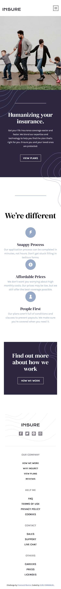
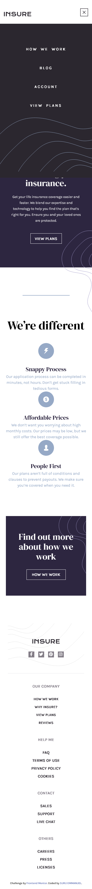
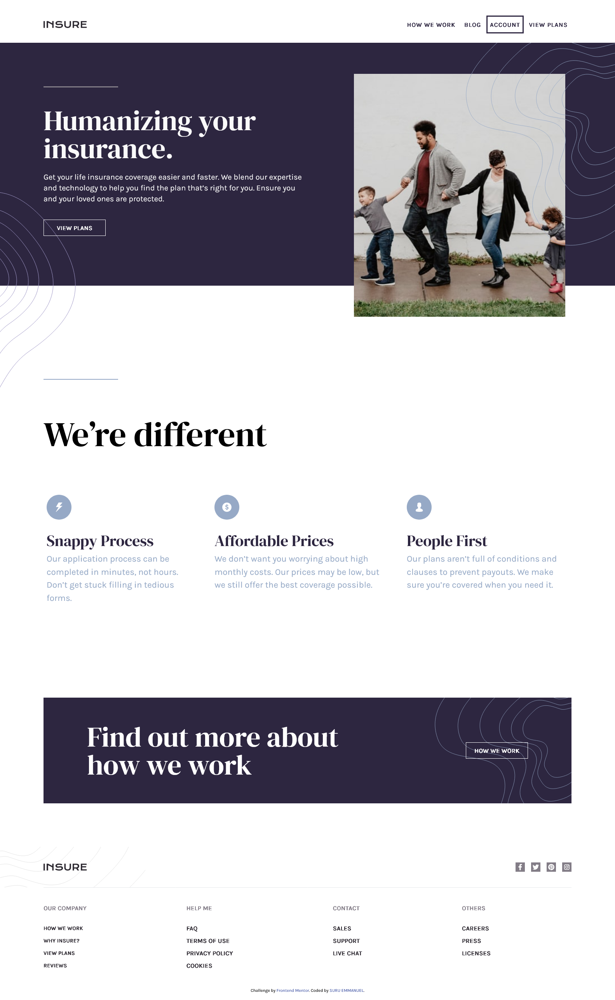

# Frontend Mentor - Insure landing page solution

This is a solution to the [Insure landing page challenge on Frontend Mentor](https://www.frontendmentor.io/challenges/insure-landing-page-uTU68JV8).

## Table of contents

- [Overview](#overview)
  - [Screenshot](#screenshot)
  - [Links](#links)
- [My process](#my-process)
  - [Built with](#built-with)
  - [Continued development](#continued-development)
- [Author](#author)
- [Acknowledgments](#acknowledgments)

## Overview

### Screenshot

### Links

- Solution URL: [Add solution URL here](https://your-solution-url.com)
- Live Site URL: [Add live site URL here](https://your-live-site-url.com)

## My process

### Built with

- Semantic HTML5 markup
- CSS custom properties
- Flexbox
- CSS Grid
- Tailwindcss

### Continued development

In future projects, I will like to focus on using javaScript for the toggle interactivities. Did everything with css but am sure it could be lesser work with javascript.

## Author

- SURU EMMANUEL
- Frontend Mentor - [@suruaino](https://www.frontendmentor.io/profile/suruaino)
- Twitter - [@suruaino](https://www.twitter.com/suruaino)

## Acknowledgments

I will want to use this opportunity to thank my lovely sister Ojeifo Loveth and her husband Obende Daniel for their support and encouragement. They kept pushing me right from the day I started this journey till date. They never got tired. I want to say that I really appreciate.
